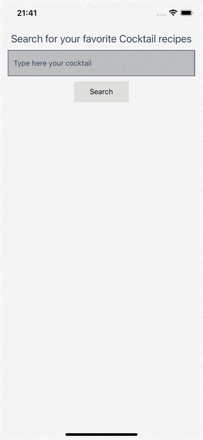

# Cocktail - Mobile App
  Developed a small application that calls cocktail api to show drinks and details of how to prepare it.





## Table of contents

  - [General info](#general-info)
  - [Main Technologies Used](#main-technologies-used)
  - [Features](#features)
  - [Screenshots](#screenshots)
  - [Setup](#setup)


	
## Main Technologies Used
- React - version 17.0.2
- React Native - version 0.67.4
- React Navigation - version 6
- Redux Toolkit - version 1.8.1

## Features

- Search cocktails
- View cocktail details


	
## Setup

##### To run this project:

-  For iOS
You will need Node, Watchman, the React Native command line interface, Xcode and CocoaPods.

-  For Android
You will need Node, Watchman, the React Native command line interface, a JDK, and Android Studio.

[Setting up the environment following React Native doc instructions.](https://reactnative.dev/docs/environment-setup) 


##### Running your React Native application after have your setup ready: 

```bash
$ yarn 
$ yarn start
$ yarn android
$ npx pod-install && yarn ios
```
